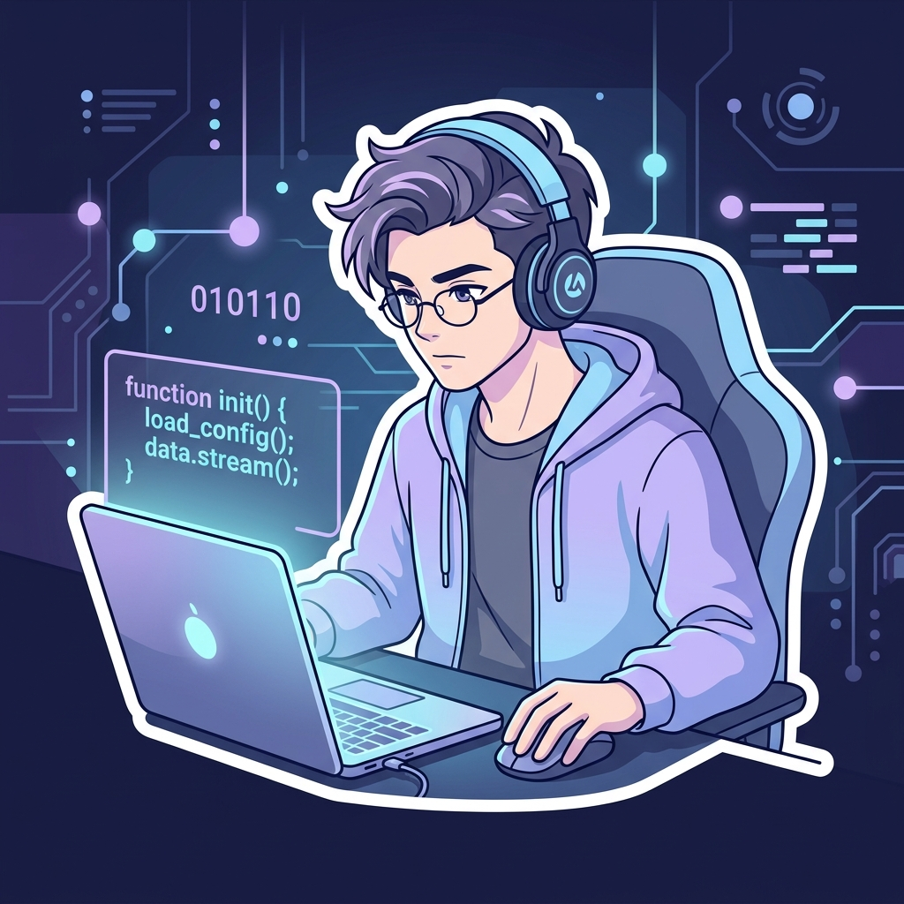

  <!-- ═══ HEADER BANNER (PASTEL BLUE GRADIENT) ═══ -->
  <picture>
    <source media="(prefers-color-scheme: dark)" srcset="https://capsule-render.vercel.app/api?type=waving&color=gradient&customColorList=1E293B,2D4B73,4682B4,89B4FA&height=210&section=header&text=Jaime%20Gabriel&fontSize=48&fontColor=F8FAFC&fontAlignY=36&desc=Ingenier%C3%ADa%20%C2%B7%20Software%20Developer%20%C2%B7%20IPN&descFontSize=17&descAlignY=58&descAlign=50" />
    <source media="(prefers-color-scheme: light)" srcset="https://capsule-render.vercel.app/api?type=waving&color=gradient&customColorList=E0F2FE,BAE6FD,90CDF4,89B4FA&height=210&section=header&text=Jaime%20Gabriel&fontSize=48&fontColor=0F172A&fontAlignY=36&desc=Ingenier%C3%ADa%20%C2%B7%20Software%20Developer%20%C2%B7%20IPN&descFontSize=17&descAlignY=58&descAlign=50" />
    
  </picture>

  <!-- ═══ SUBTITLE ANIMATION ═══ -->
  <picture>
    <source media="(prefers-color-scheme: dark)" srcset="https://readme-typing-svg.demolab.com?font=Fira+Code&weight=600&size=19&duration=3000&pause=1000&color=89B4FA&center=true&vCenter=true&width=620&lines=Estudiante+de+Ingenier%C3%ADa+%40+IPN+%F0%9F%8E%93;Backend+%26+Software+Engineering+%E2%9A%99%EF%B8%8F;Resoluci%C3%B3n+de+Problemas+%26+Algoritmos+%F0%9F%A7%A0;Construyendo+software+escalable+y+limpio+%E2%9C%A8" />
    <source media="(prefers-color-scheme: light)" srcset="https://readme-typing-svg.demolab.com?font=Fira+Code&weight=600&size=19&duration=3000&pause=1000&color=2563EB&center=true&vCenter=true&width=620&lines=Estudiante+de+Ingenier%C3%ADa+%40+IPN+%F0%9F%8E%93;Backend+%26+Software+Engineering+%E2%9A%99%EF%B8%8F;Resoluci%C3%B3n+de+Problemas+%26+Algoritmos+%F0%9F%A7%A0;Construyendo+software+escalable+y+limpio+%E2%9C%A8" />
    
  </picture>

   

  <!-- ═══ VISITOR COUNTER & PASTEL SOCIAL BADGES ═══ -->
  

    
    &nbsp;
    
    &nbsp;
    
    &nbsp;
    
    &nbsp;
    
  

  <!-- ═══ PASTEL DIVIDER ═══ -->
  <picture>
    <source media="(prefers-color-scheme: dark)" srcset="https://capsule-render.vercel.app/api?type=rect&height=2&color=89B4FA" />
    <source media="(prefers-color-scheme: light)" srcset="https://capsule-render.vercel.app/api?type=rect&height=2&color=90CDF4" />
    
  </picture>

 

### 🩵 Sobre mí

<!-- Sticker / Avatar flotante lateral -->

| 🏷️ **Categoría** | 📌 **Detalles** |
| :--- | :--- |
| 🎓 **Universidad** | Instituto Politécnico Nacional (IPN) 🇲🇽 |
| 💻 **Especialidad** | Desarrollo de Software · Backend · Arquitectura de Sistemas |
| ⚡ **Enfoque Principal** | Código limpio, algoritmos eficientes y diseño modular |
| 🌱 **Explorando** | Arquitecturas distribuidas, Microservicios & Cloud |
| 🌐 **Idiomas** | Español (Nativo) · Inglés (Técnico) |
| 📫 **Contacto** | [jhernandezg1915@alumno.ipn.mx](mailto:jhernandezg1915@alumno.ipn.mx) |

 

  <picture>
    <source media="(prefers-color-scheme: dark)" srcset="https://capsule-render.vercel.app/api?type=rect&height=2&color=89B4FA" />
    <source media="(prefers-color-scheme: light)" srcset="https://capsule-render.vercel.app/api?type=rect&height=2&color=90CDF4" />
    
  </picture>

 

### 🛠️ Stack Tecnológico

  
<b>Lenguajes</b>

  

    

  
<b>Frontend & UI</b>

  

    

  
<b>Backend & Bases de Datos</b>

  

    

  
<b>Herramientas & Entorno</b>

  

 

  <picture>
    <source media="(prefers-color-scheme: dark)" srcset="https://capsule-render.vercel.app/api?type=rect&height=2&color=89B4FA" />
    <source media="(prefers-color-scheme: light)" srcset="https://capsule-render.vercel.app/api?type=rect&height=2&color=90CDF4" />
    
  </picture>

 

### 📊 Actividad y Estadísticas en GitHub

  <!-- Racha de contribuciones con paleta pastel Nord -->
  

    

  <!-- Métricas de perfil y distribución de lenguajes -->
  
  

    

  <!-- Cita de programación dinámica pastel -->
  

 

  <picture>
    <source media="(prefers-color-scheme: dark)" srcset="https://capsule-render.vercel.app/api?type=rect&height=2&color=89B4FA" />
    <source media="(prefers-color-scheme: light)" srcset="https://capsule-render.vercel.app/api?type=rect&height=2&color=90CDF4" />
    
  </picture>

 

### 🧩 Extras & Configuración

  
<b>⚙️ Entorno de Desarrollo & Dotfiles</b>

   

  - 💻 **Sistema:** Linux (WSL2 / Arch) & Windows 11
  - 🖥️ **Terminal:** Windows Terminal / Alacritty + Zsh & Starship Prompt
  - 📝 **Editor Principal:** Visual Studio Code / Neovim
  - 🎨 **Temas Favoritos:** Tokyo Night, Catppuccin Mocha & Nord
  - 🔤 **Tipografía:** JetBrains Mono & Fira Code Nerd Font

  
<b>🎯 Metas & Roadmap 2026</b>

   

  - [ ] Consolidar conocimientos en arquitecturas distribuidas y microservicios.
  - [ ] Desarrollar proyectos de alto rendimiento en C++ y Python.
  - [ ] Realizar contribuciones continuas a proyectos de código abierto.
  - [ ] Certificación Cloud (AWS / Azure).

 

<!-- ═══ FOOTER BANNER ═══ -->

  <picture>
    <source media="(prefers-color-scheme: dark)" srcset="https://capsule-render.vercel.app/api?type=waving&color=gradient&customColorList=1E293B,2D4B73,4682B4,89B4FA&height=100&section=footer" />
    <source media="(prefers-color-scheme: light)" srcset="https://capsule-render.vercel.app/api?type=waving&color=gradient&customColorList=E0F2FE,BAE6FD,90CDF4,89B4FA&height=100&section=footer" />
    
  </picture>
  Diseñado con precisión · <b>Jaime Gabriel Hernández García</b>

